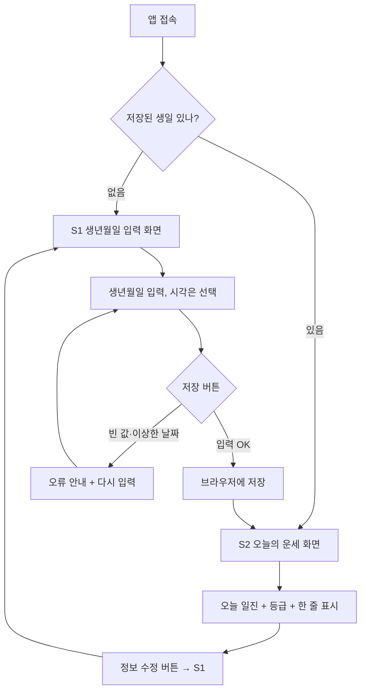

# 유저 플로우 — 사주 플래너 (실습)

## 메인 플로우 (첫 방문 → 목적 달성)

## 재방문 플로우
- 다음에 다시 들어오면 저장된 생일을 읽어 곧바로 S2 오늘의 운세를 보여준다 (생년월일 재입력 없음).

## 운영자 플로우
- 없음 (단일 사용자, 관리자 페이지 없음)

## 화면 색인 (상세는 화면별 파일로)
| 화면 | 파일 | 목적 한 가지 |
|---|---|---|
| S1 생년월일 입력 | screens/S1-생년월일입력.md | 내 사주 정보를 받아 저장 |
| S2 오늘의 운세 | screens/S2-오늘의운세.md | 저장된 사주로 오늘 운세 표시 |
