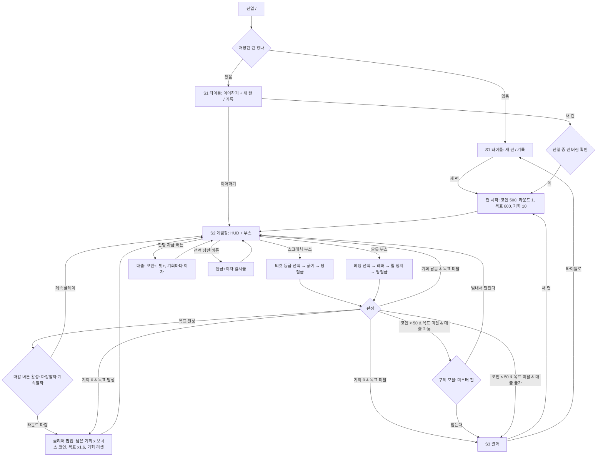

# 유저플로우 — 럭키런

## 갈림길 정리
- 저장된 런이 있으면 타이틀에 이어하기가 추가로 뜬다. 이어하기는 저장 상태 그대로 S2 복귀.
- 진행 중 런이 있는데 새 런을 누르면 "지금 런을 버립니까?" 확인 후 시작.
- 목표를 미리 달성하면 "라운드 마감" 버튼이 켜진다 (허점 라운드 확정): 마감 = 남은 기회당 보너스 코인(라운드 비례)을 받고 안전하게 클리어 / 계속 = 더 벌 수도, 목표 밑으로 떨어져 죽을 수도. 이 선택이 게임의 핵심 전략이다.
- 게임오버 순간 저장된 런은 삭제되고 최고 기록만 갱신된다(빚 활성 시 기록은 순자산 기준).
- 대출 판정 이원화: 목표 달성·마감 = 순자산(코인-빚) / 파산·구매 가능 = 총 코인. 이 이원화가 "대출로 공짜 클리어"와 "대출 직후 즉사"를 동시에 막는다 (docs/plan/changes/2026-07-08-사채상어-미스터핀-대출.md).
- 이어하기 진입 시 즉시 판정 — 플레이 도중(지불 후) 저장된 런이 조작 불능으로 멈추는 것을 방지.

## 화면 색인
| 화면 | 파일 | 요약 |
|------|------|------|
| S1 타이틀 | docs/plan/screens/S1-타이틀.md | 새 런·이어하기·기록·고지 |
| S2 게임장 | docs/plan/screens/S2-게임장.md | HUD + 스크래치/슬롯 부스 + 판정 |
| S3 결과 | docs/plan/screens/S3-결과.md | 도달 라운드·코인·신기록·새 런 |
