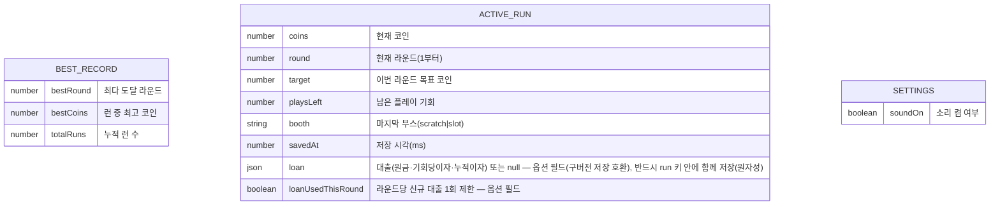

# 데이터 설계 — 럭키런

> 클라우드 DB 없음. 브라우저 localStorage 3키. 단 게임 코드가 localStorage 를 직접 만지지 않고
> **저장 어댑터**(load/save/clear 함수 묶음, apps/web/lib/game/save.ts) 를 통해서만 접근한다 —
> 스팀판(Electron/Tauri)에서 파일 저장·Steam Cloud 로 갈아끼우기 위한 한 겹이다.

## 표(키) 목록

| localStorage 키 | 내용 | 언제 쓰나 | 언제 지우나 |
|----|----|----|----|
| `luckyrun:best` | BEST_RECORD | 게임오버마다 갱신 비교 | 타이틀 "기록 초기화" (확인 후) |
| `luckyrun:run` | ACTIVE_RUN | 매 플레이 직후 | 게임오버 시·새 런 시작 시 |
| `luckyrun:settings` | SETTINGS | 음소거 토글 시 | 지우지 않음 |

## 권한 / 삭제 정책
- 전부 사용자 본인 브라우저 안 — 서버 전송 없음, 개인정보 없음.
- 기록 초기화는 확인 문답 후에만. ACTIVE_RUN 은 게임 규칙에 따라 자동 삭제.
- 읽기 시 JSON 파싱 실패·형식 불일치면 그 키를 없는 것으로 취급(조용히 새 값) — 에러 화면 금지.

## 관계
- 표 3개는 서로 참조하지 않는다 (관계 없음).
