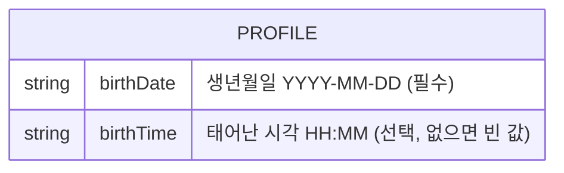

# DB 설계 — 사주 플래너 (실습)

> 이 MVP는 저장을 **브라우저(localStorage)** 로 한다 — 클라우드 DB(Supabase)를 쓰지 않는다.
> 그래서 SQL·RLS(창고 문 앞 출입 규칙)는 이번엔 없다. "표"는 브라우저에 저장되는 JSON 한 덩어리다.
> (다음 버전에서 Supabase로 옮길 때 이 문서에 SQL·RLS를 추가한다.)

## 표 목록
| 표 | 무엇 | 소유 | 1년 규모 |
|---|---|---|---|
| profile | 내 사주 정보 (생년월일·시각) | 본인 | 1건 (덮어쓰기) |

## 관계 도식

- 표가 하나뿐이라 표 사이의 관계는 없다.

## 저장 형태 (localStorage)
- 키(key): `sajuweb:profile`
- 값(value): JSON — 예: `{"birthDate":"1996-03-15","birthTime":"07:30"}`
- 시각을 모르면 `birthTime`은 빈 문자열(`""`)로 둔다 → 계산에서 시주(時柱)를 제외.

## 권한
- 단일 사용자·로그인 없음. 데이터는 이 브라우저 안에만 있고 다른 사람이 접근할 수 없다(다른 사이트·다른 기기와 분리).

## 삭제 정책
- "정보 수정"으로 덮어쓰기만 한다. 별도 삭제 화면은 MVP에 없음. (초기화가 필요하면 브라우저 콘솔에서 `localStorage.removeItem('sajuweb:profile')`.)

## 검색·정렬
- 해당 없음 (1건).

## SQL 초안
- 해당 없음 (브라우저 저장). Supabase 전환 시 이 자리에 `create table profile ...` + RLS를 추가한다.
