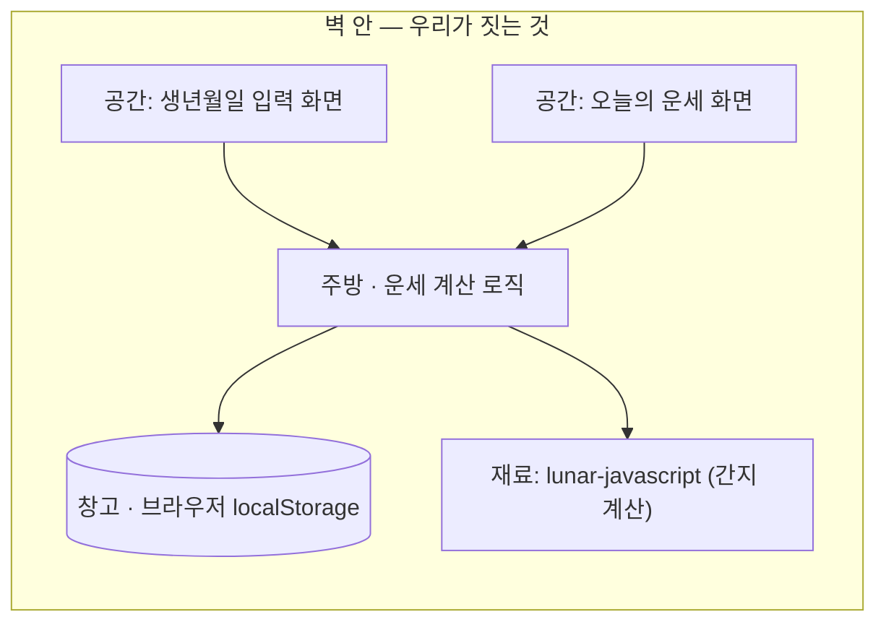

# 시스템 지도 — 사주 플래너 (실습)
> 이 앱이 어떤 부품으로 되어 있고, 밖에서 뭘 빌려오는지 한 장.
> 식당 비유: 홀(화면) · 주방(계산 로직) · 창고(저장) · 문(외부 서비스) · 건물(배포).

## 한눈 도식

- 밖에서 빌리는 "문(외부 서비스)"은 없다. lunar-javascript는 서비스가 아니라 주방에 놓고 쓰는 무료 라이브러리(재료).

## 누가 들어오나 (역할 → 공간)
| 역할 | 들어가는 공간 | 할 수 있는 일 |
|---|---|---|
| 사용자(본인) | 입력 화면 · 운세 화면 | 생년월일 저장, 오늘 운세 보기 |

## 빌려오는 것 (문 목록)
| 문(서비스) | 무엇을 대신해주나 | 어느 기능에 필요한가 | .env 키 | 과금 |
|---|---|---|---|---|
| (없음) | — | — | — | — |

- 재료: `lunar-javascript` (npm, MIT) — 생년월일·날짜를 간지로 변환. 키 불필요.

## 이번 스코프에서 안 여는 문
- Supabase(클라우드 저장·로그인) — 다음 버전으로 (06-decisions 참조)
- Vercel(배포) — 이번 스코프 밖
- AI 상담(Claude 등) — 로드맵
