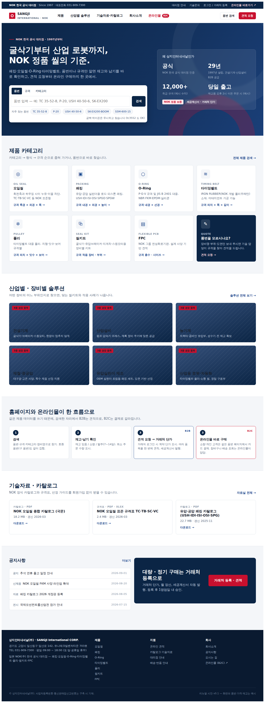
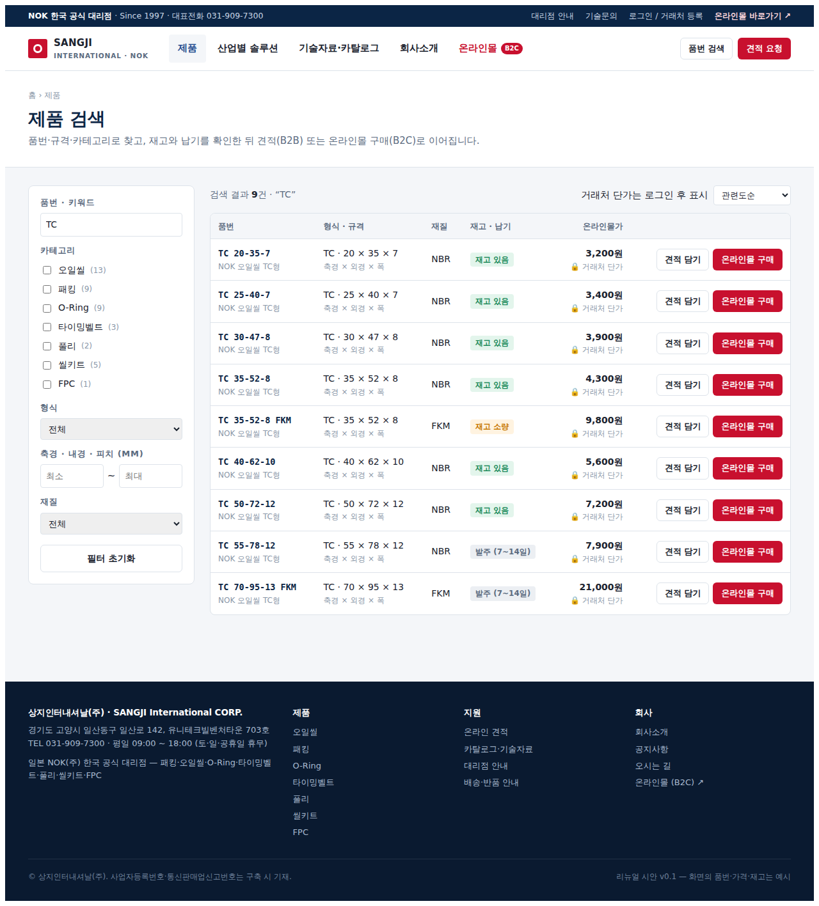
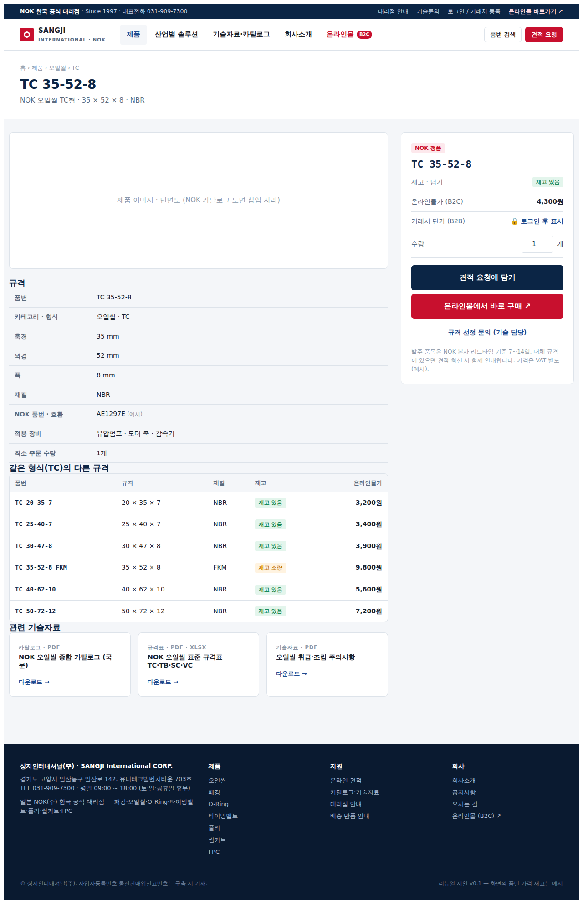
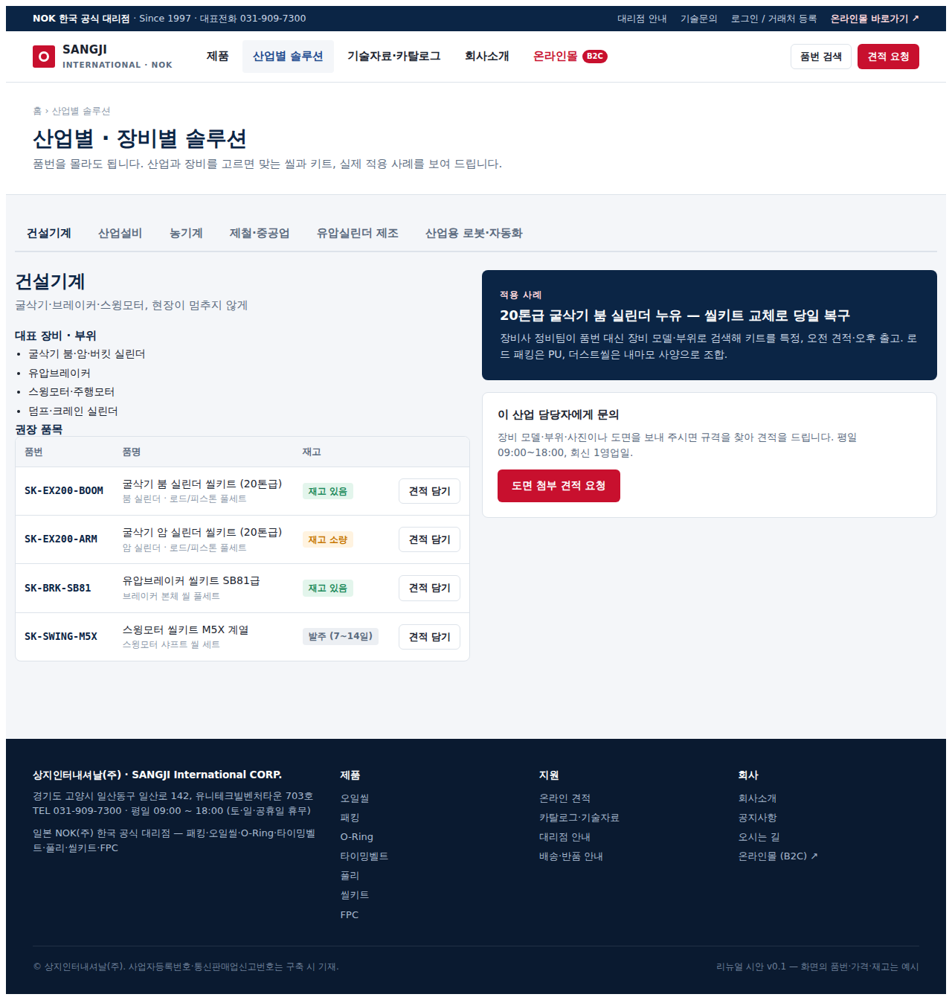
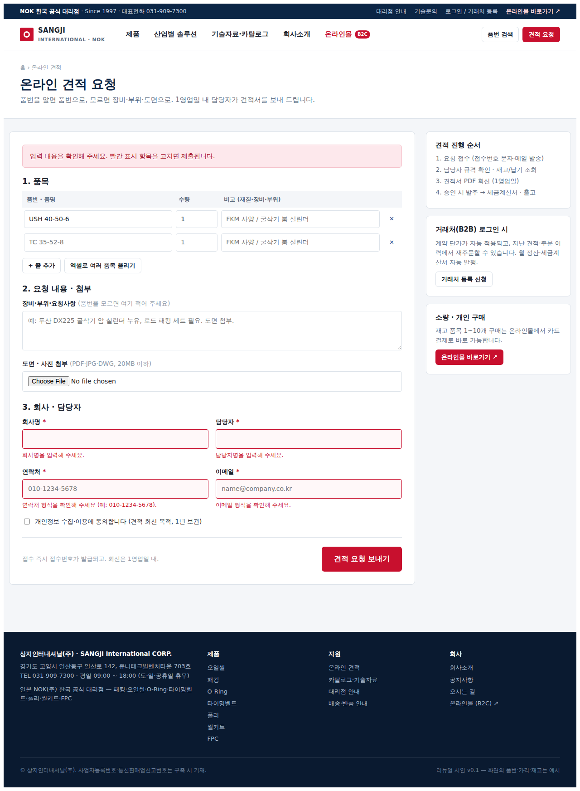

# 상지인터내셔날 홈페이지 리뉴얼 제안서 (시안 + 방안 비교 + 견적)

- 작성일: 2026-09-07 · 버전 v0.1 (범위 견적)
- 대상: 상지인터내셔날(주) — NOK 한국 공식 대리점, 패킹·오일씰·O-Ring·타이밍벨트·풀리·씰키트·FPC
- 요청 요약: SKF 형 기업 홈페이지 + MISUMI 형 산업재 온라인몰 결합. ① 고도몰 PRO 유지 리뉴얼 ② 신규 서버·시스템 통합 구축, 두 방안의 장단점·비용·유지보수·확장성 비교와 시안.

---

## 1. 한 장 요약

| | 방안 1 · 고도몰 PRO 유지 리뉴얼 | 방안 3 · 절충안 (추천) | 방안 2 · 신규 통합 구축 |
|---|---|---|---|
| 한 줄 | 고도몰 안에서 새 옷 입히기 + 기능 보강 | 홈페이지·검색·견적은 새로 짓고, 결제·배송은 고도몰이 계속 | 홈페이지+쇼핑몰을 한 시스템으로 새로 짓기 |
| 구축비 (VAT 별도) | **2,500 ~ 4,400만 원** | **4,000 ~ 6,500만 원** | **6,000 ~ 10,000만 원** |
| 기간 | 8 ~ 12주 | 12 ~ 16주 | 16 ~ 24주 |
| 월 운영비 | 약 10 ~ 90만 원 | 약 30 ~ 150만 원 | 약 60 ~ 200만 원 |
| 검색(품번·규격·범위) | △ 품번·키워드는 가능, 치수 범위 검색은 제한적 | ◎ 자유 | ◎ 자유 |
| 온라인 견적·B2B 단가 | △ 회원등급 가격 + 게시판형 견적 | ◎ 견적 워크플로 자유 | ◎ + 주문·정산까지 한 흐름 |
| 홈↔몰 연결 | ○ 한 시스템이라 자연스러움 (표현 제한) | ○ 딥링크 + 상품 동기화 | ◎ 완전 단일 |
| 브랜드·SEO·속도 | △ 템플릿 한계 | ◎ | ◎ |
| 리스크 | 낮음 (결제·회원 그대로) | 중간 (두 시스템 운영) | 높음 (결제·법규·이전) |
| 확장성 (ERP·다국어·앱) | 중 | 상 | 상 |

**추천**: 예산 4,000만 원 이상이면 **방안 3(절충안)** 으로 시작해, 안정된 뒤 2단계에서 결제까지 흡수(방안 2로 자연 이행). 예산이 4,000만 원 미만이거나 3개월 내 오픈이 목표면 **방안 1**. 처음부터 방안 2로 가는 것은 "결제·회원 이전"이라는 가장 위험한 작업을 첫 단계에 두는 셈이라, 반드시 필요한 이유(예: ERP 실시간 재고 연동, 해외몰)가 있을 때만 권한다.

---

## 2. 현 홈페이지 진단 (공개 정보 기준)

> 이 세션에서는 sangjiintl.co.kr 에 직접 접속할 수 없어, 검색엔진에 잡힌 페이지 구조와 본문으로 진단했다. 실제 화면을 열어 보면 보완할 점이 더 나올 수 있다.

현 구조 (URL 로 본 메뉴): `sub01`(회사소개 — 인사말·연혁·대리점 안내) / `sub02`(제품 — 패킹·타이밍벨트·FPC…) / `sub03`(고객지원 — 자료실 등) + 별도 온라인몰(고도몰 PRO).

| 항목 | 현재 | 리뉴얼 목표 |
|---|---|---|
| 제품 페이지 | 제품군별 **설명 페이지**(패킹이란·오일씰이란). 품번·규격 단위 데이터 없음 | 품번·규격 단위 **데이터**로 전환 → 검색·비교·견적의 재료 |
| 검색 | 사이트 내 검색 없음(공개 페이지 기준). 몰은 고도몰 기본 검색(상품명 위주) | 품번 정규화 검색(`tc3552` 도 `TC 35-52-8` 을 찾음), 규격 범위, 카테고리→형식→규격 좁히기 |
| 홈페이지 ↔ 몰 | 링크로만 연결, 디자인·회원·데이터 분리 | 같은 제품 데이터 위에서 B2B(견적)·B2C(결제)가 갈라지는 한 흐름 |
| 신뢰 요소 | 회사소개 텍스트 위주 | NOK 공식 대리점 인증·연혁·적용사례·인증서 다운로드를 첫 화면에 |
| 기술자료 | 게시판형 자료실 | 제품군별 카탈로그·규격표(엑셀)·선정가이드, 제품 상세에서 바로 연결 |
| 견적 | 전화·이메일 (추정) | 온라인 견적(여러 품목·도면 첨부·접수번호), 거래처 로그인 시 계약 단가 |
| 모바일 | PHP 고정폭 사이트일 가능성 (확인 필요) | 반응형(현장 정비 담당자가 폰으로 품번 검색) |

---

## 3. 벤치마크에서 가져올 것 · 버릴 것

| 사이트 | 가져올 것 | 안 가져올 것 |
|---|---|---|
| **SKF** (기업형) | 산업별/서비스별 진입, 큰 여백·사진의 신뢰감, "적용사례" 콘텐츠, 글로벌 톤의 푸터 | 대기업 규모의 방대한 메뉴 깊이 — 상지 규모에선 5개 대메뉴면 충분 |
| **Parker** (카테고리) | 카테고리 카드 → 하위 카테고리 → 규격 필터의 계단식 구조, 상세의 "유통사 찾기/견적" CTA | 수만 SKU 전제의 복잡한 파라메트릭 UI — 우리는 축경·내경 등 핵심 치수 3개만 |
| **MISUMI** (산업재몰) | 품번 직접 입력 검색, 재고·납기 즉시 표시, 같은 형식의 규격 배리에이션 표, 엑셀로 여러 품목 한 번에 견적, 최소 주문 수량 | 자동 가격 계산·납기 자동화(초기엔 담당자 회신형으로), 과밀한 정보 밀도 |

---

## 4. 정보구조(IA) 제안

```
홈
├─ 제품 (검색 허브)            /products?q=&cat=
│   ├─ 오일씰 · 패킹 · O-Ring · 타이밍벨트 · 풀리 · 씰키트 · FPC
│   └─ 제품 상세 (규격·호환품번·적용장비·배리에이션·자료)   /products/{품번}
├─ 산업별 솔루션 (건설기계·산업설비·농기계·제철·실린더제조·로봇)  /solutions
├─ 기술자료·카탈로그 (카탈로그·규격표·선정가이드·기술자료·인증서)  /resources
├─ 회사소개 (공식대리점·연혁·오시는 길·대리점 안내)          /about
├─ 온라인 견적 (품목표·도면첨부·회사정보 → 접수번호)          /quote
└─ 온라인몰 (B2C 결제)  ─ 상단 띠·대메뉴·제품 상세에서 딥링크
```

대메뉴 5개: **제품 · 산업별 솔루션 · 기술자료·카탈로그 · 회사소개 · 온라인몰(B2C 배지)**. 상단 얇은 띠에 "NOK 한국 공식 대리점 · Since 1997 · 대표전화", 우측에 대리점 안내·기술문의·로그인(거래처 등록)·온라인몰.

---

## 5. 화면 시안 (클릭 가능한 프로토타입, `pnpm dev` → `/sangji`)

요청하신 6개 방향이 어느 화면에서 구현되는지:

| 요구 | 화면 | 시안에서 확인할 것 |
|---|---|---|
| 기업 신뢰도·브랜드 | S1 홈, S6 회사소개 | 히어로의 "NOK 공식 대리점 · 1997년부터", 신뢰 패널(공식·29년·취급 규격·당일 출고), NOK 정품 배지, 인증서 다운로드 |
| 산업별/장비별 솔루션·적용사례 | S4 솔루션 | 6개 산업 탭 → 대표 장비·권장 품목(재고 포함)·적용 사례·담당자 문의 |
| 기술자료·카탈로그 | S5 자료실, S3 상세 하단 | 종류(카탈로그·규격표·가이드·기술자료·인증서)×제품군 필터, 상세 페이지에서 관련 자료 바로 연결 |
| 강력한 제품 검색 | S1 검색창, S2 제품 검색 | 품번/규격/카테고리 탭, 정규화 검색(`tc3552`), 카테고리·형식·치수 범위·재질 필터, 정렬, 빈 결과 시 견적 유도 |
| 온라인 견적·주문 | S3 상세 구매박스, S7 견적 | 견적 담기(품번 자동 입력)·온라인몰 구매 두 갈래, 여러 품목·도면 첨부·입력 검사·접수번호 |
| 홈↔몰 자연 연결 | S1 "한 흐름" 섹션, S2/S3 버튼 | 검색 → 재고·납기 → B2B 견적 / B2C 온라인몰 구매 로 갈라지는 4단계 흐름 |

### S1 홈 (`screens/S1-home.png`, 모바일 `S1-home-mobile.png`)

- 첫 화면에 **큰 검색창**(MISUMI)과 **신뢰 패널**(SKF)을 나란히. 자주 찾는 품번 칩으로 검색 부담을 줄임.
- 카테고리 8칸 중 마지막은 "품번을 모르시나요? → 견적" — 품번 모르는 정비 담당자를 놓치지 않기 위함.
- "홈페이지와 온라인몰이 한 흐름으로" 섹션이 B2B/B2C 분기 구조를 설명.

### S2 제품 검색 (`S2-products.png`, 오류 `S2b-filter-error.png`, 빈 결과 `S2c-empty.png`)

- 왼쪽 필터: 품번·키워드 / 카테고리(개수) / 형식 / 치수 범위 / 재질. 오른쪽 결과표: 품번·형식·규격·재질·재고/납기·온라인몰가·[견적 담기][온라인몰 구매].
- **거래처 단가는 🔒 로그인 후 표시** — B2B 가격을 공개하지 않으면서 로그인 동기를 만드는 장치.
- 예외 처리: 결과 없음(견적 유도) · 치수 범위 오입력(문구) · 불러오는 중.

### S3 제품 상세 (`S3-detail.png`)

- 규격표 · NOK 품번/호환 · 적용 장비 · 최소 주문 수량 · **같은 형식의 다른 규격**(MISUMI 배리에이션) · 관련 기술자료.
- 오른쪽 구매 박스: 재고/납기 → B2C 가격 → B2B 잠금 → 수량 → [견적 요청에 담기] [온라인몰에서 바로 구매] [규격 선정 문의].

### S4 산업별 솔루션 (`S4-solutions.png`) · S5 기술자료 (`S5-resources.png`) · S6 회사소개 (`S6-about.png`)


### S7 온라인 견적 (`S7-quote.png`, 입력 오류 `S7b-quote-errors.png`, 접수 완료 `S7c-quote-done.png`)

- 품목 여러 줄(+엑셀 업로드 자리) → 요청 내용·도면 첨부 → 회사·담당자 → 접수번호. 오른쪽에 진행 순서·거래처 등록·소량 구매(온라인몰) 안내.

### 시안 검증 기록 (자동 브라우저 조작, 2026-09-07)
홈 검색 `tc3552` → 결과 2건(NBR·FKM) / 전체 42건 → 오일씰 13건 → 축경 40~60 → 5건 / 최소>최대 오류 문구 / 존재하지 않는 품번 → 빈 결과 화면 / 상세 → 견적 담기 → 품번 자동 입력 / 빈 제출 → 오류 4개 → 채우면 접수번호 발급 / 솔루션 해시(#robot)·탭 전환 / 모바일 390px 가로 스크롤 없음 / 콘솔 오류 0 (favicon 404 제외).

---

## 6. 방안 1 — 고도몰 PRO 유지 + 디자인·기능 리뉴얼

**어떻게 만드나**
- 고도몰5 PRO 의 디자인 스킨을 전면 재제작(홈·카테고리·검색결과·상품상세·마이페이지·주문). 기업 콘텐츠(회사소개·솔루션·자료실·적용사례)는 고도몰의 디자인 페이지·게시판 기능으로 몰 안에 넣어 **한 도메인·한 디자인**으로 통합.
- 검색 강화: 상품 등록 시 "자체 상품코드=품번", 검색 키워드에 정규화 표기(공백·하이픈 제거형, 구 품번)를 넣고, PRO 전용 **기능커스텀**(PHP 소스 수정)으로 검색 결과 정렬·품번 우선 매칭을 손봄. 축경·내경 같은 치수는 상품 옵션/추가 항목으로 등록해 카테고리 내 필터 정도까지.
- 견적: 장바구니 → "견적서 요청" 버튼(기능커스텀) + 견적 게시판(첨부). B2B 단가는 고도몰 **회원등급별 가격·가격 비공개** 기능 활용.
- 온라인몰과 홈페이지가 같은 시스템이므로 "연결" 문제는 자연히 해결. NOK 자료는 자료실 게시판 + 상품 상세 첨부.

**비용 (VAT 별도, 범위)**

| 항목 | 금액(만 원) | 비고 |
|---|---|---|
| 기획·IA·와이어프레임 | 200 ~ 300 | 이 제안서·시안을 출발점으로 |
| 디자인·퍼블리싱 (스킨 전면, 반응형) | 1,200 ~ 1,800 | PC·모바일 스킨, 기업 콘텐츠 페이지 6~8종 포함 |
| 기능커스텀 (검색 정규화·견적 플로우·B2B 노출) | 700 ~ 1,400 | PHP 소스 수정. 고도몰 정책 안에서 |
| 콘텐츠 제작 (솔루션·사례·카탈로그 정리·촬영) | 300 ~ 600 | 사진 촬영 별도 가능 |
| 데이터 정비 (품번·규격 속성 입력, 엑셀 일괄 등록) | 100 ~ 300 | SKU 수에 비례 |
| **합계** | **2,500 ~ 4,400** | |

**운영비**: 고도몰5 PRO 이용료(월 3.3만 원 수준) + 트래픽·용량 추가분 + 선택 유지보수 월 30~80만 원. PG 수수료는 현행 유지.

**장점** — 결제·회원·주문·배송·PG 를 그대로 쓰니 **사고 위험이 가장 낮음**. 비용·기간 절반. 운영진이 익숙한 관리자 화면 그대로. 고도몰의 마켓 연동·앱 빌더 등 부가 기능 계속 활용.

**단점** — ① 규격 **범위 검색·파라메트릭 필터**는 고도몰 검색 구조상 제한적(옵션 필터 수준). ② 기업 홈페이지 표현이 몰 템플릿 구조 안에 갇힘(레이아웃 자유도·SEO·속도). ③ 커스텀 코드가 **고도몰 업데이트에 깨질 수 있음** — 업데이트 때마다 점검 비용. ④ ERP·재고 연동은 오픈 API 범위 안에서만. ⑤ 데이터·디자인이 고도몰에 종속(나중에 옮기려면 다시 큰 공사).

**유지보수 편의성**: 상 (익숙함) / **확장성**: 중.

---

## 7. 방안 2 — 신규 서버·시스템으로 홈페이지+쇼핑몰 통합 구축

**어떻게 만드나 (권장 구성)**
- 화면: Next.js (이 시안과 같은 기술) — PC·모바일 반응형, 서버 렌더링으로 SEO·속도 확보.
- 창고(DB): PostgreSQL — 제품·규격(치수 숫자 컬럼)·재고·가격표(등급별)·견적·주문·회원·자료. 규격은 **숫자 컬럼**으로 두어 범위 검색·정렬이 가능(고도몰과의 결정적 차이).
- 검색: 품번 정규화 컬럼 + 전문검색. SKU 가 수만 개를 넘으면 검색 전용 엔진(Meilisearch 등) 추가.
- 결제·주문: 국내 PG(토스페이먼츠/KG이니시스 등) 연동, 현금영수증·세금계산서 발행 연동, 배송 추적.
- 관리자: 상품·규격 엑셀 일괄 업로드, 견적 관리(회신·PDF), 거래처 승인·등급 단가, 주문·배송, 자료실, 공지.
- 서버: 클라우드(Vercel/Cloudflare + 관리형 DB, 또는 국내 클라우드) — 서버 관리 인력 없이 운영.
- 이전: 고도몰의 회원·주문 이력·상품 데이터를 API/엑셀로 추출해 이전, 몰 도메인 301 리다이렉트.

**비용 (VAT 별도, 범위)**

| 항목 | 금액(만 원) | 비고 |
|---|---|---|
| 기획·IA·UX·화면정의 | 500 ~ 800 | 예외 상태·관리자 화면까지 정의 |
| 디자인 (브랜드 시스템·PC·모바일) | 1,000 ~ 1,500 | |
| 화면 구현 (고객용 12~15화면) | 1,500 ~ 2,500 | |
| 창고·검색·견적·B2B 단가·관리자 | 2,000 ~ 3,500 | 가장 큰 항목 |
| 결제·배송·세금계산서·회원 이전 | 500 ~ 1,000 | PG 심사·법규 대응 포함 |
| 콘텐츠·데이터 정비 | 300 ~ 600 | |
| QA·보안 점검·배포·교육 | 300 ~ 500 | |
| **합계** | **6,000 ~ 10,000** | |

**운영비**: 클라우드·DB·파일저장 월 5~30만 원 + PG 수수료 + 유지보수 계약 월 50~150만 원(버그·소규모 개선 포함) + 도메인·인증서.

**장점** — 검색·견적·단가·ERP 연동 등 **B2B 요구를 제약 없이** 구현. 홈페이지와 몰이 완전히 하나(회원·데이터·디자인). 브랜드 표현·SEO·속도 최상. 특정 솔루션에 종속되지 않음. 다국어·앱·해외몰 확장 용이.

**단점** — 비용·기간 2배 이상. **결제·전자상거래 법규(통신판매·현금영수증·개인정보)** 를 직접 책임. 오픈 초기 버그 위험. 운영진이 새 관리자 화면 학습. 유지보수할 개발자(또는 계약)가 계속 필요. 고도몰이 주던 마켓 연동 등 부가 기능은 별도 구축.

**유지보수 편의성**: 중 (계약 필요) / **확장성**: 상.

---

## 8. 방안 3 — 절충안 (추천): 새 홈페이지·검색·견적 + 고도몰 결제 유지

**어떻게 만드나**
- 방안 2의 구성으로 **홈페이지·제품 검색·상세·솔루션·자료실·온라인 견적·거래처(B2B) 기능**을 새로 짓는다. 이 시안이 그 출발점.
- **B2C 결제·주문·배송·CS 는 고도몰이 계속** 맡는다. 제품 상세의 [온라인몰에서 바로 구매] 가 고도몰의 같은 상품 페이지로 바로 연결(딥링크).
- 상품 데이터는 새 시스템이 원본(마스터). 고도몰 **오픈 API** 로 상품·가격·재고를 하루 N 회 동기화 → 두 곳 정보가 어긋나지 않게.
- 고도몰 스킨은 새 디자인 토큰(색·글꼴·헤더·푸터)만 입히는 **최소 리뉴얼**(500~800만 원 포함)로 이질감을 없앤다.
- 2단계(선택, 6~12개월 뒤): 결제·주문을 새 시스템으로 흡수하고 고도몰 종료 → 방안 2 완성형. 이때 1단계 코드는 그대로 쓴다.

**비용**: 방안 2 표에서 "결제·배송·회원 이전" 항목이 빠지고 "고도몰 스킨 최소 리뉴얼 + API 동기화" 가 들어와 **4,000 ~ 6,500만 원**, 12 ~ 16주.

**운영비**: 클라우드 월 5~30만 원 + 고도몰 이용료 + 유지보수 월 30~100만 원.

**장점** — 가장 위험한 결제·회원 이전을 뒤로 미루면서, 핵심 가치(검색·솔루션·견적·브랜드)는 제약 없이 얻음. 단계적 예산 집행.
**단점** — 시스템이 둘(운영 창구 둘). B2C 회원(고도몰)과 B2B 거래처(새 시스템) 로그인이 분리. 동기화 배치 관리 필요.

---

## 9. 견적을 확정하려면 — 확인 질문 10개

1. 취급 SKU(품번) 수는 대략 몇 개인가? (수백 / 수천 / 수만) — 데이터 정비·검색 구조 결정
2. 품번·규격·재질 데이터를 **엑셀로 보유**하고 있는가, 카탈로그 PDF 뿐인가?
3. 고도몰 PRO 에 이미 적용한 커스텀(기능커스텀·외부 연동)이 있는가?
4. 현재 온라인몰 회원 수·월 주문 수 (B2C 비중) — 결제 이전 리스크 판단
5. B2B 거래처 단가는 **거래처별**인가, **등급별**인가? 세금계산서·월 정산 방식은?
6. ERP·재고 시스템이 있는가? 실시간 재고 표시가 필요한가, 담당자 확인형이면 되는가?
7. 견적 회신은 담당자 수동(PDF)으로 시작해도 되는가, 자동 가격 계산이 필요한가?
8. 제품 사진·단면도·적용 사례 사진 등 **콘텐츠 자산** 보유 현황 (촬영 필요 여부)
9. 다국어(영/일), 해외 판매, 앱 계획이 있는가?
10. 오픈 목표 시점과 예산 상한

---

## 10. 일정 (예시)

| 주차 | 방안 1 (8~12주) | 방안 3 (12~16주) | 방안 2 (16~24주) |
|---|---|---|---|
| 1~2 | 요구 확정·IA·데이터 정비 계획 | 요구 확정·IA·데이터 모델 | 요구 확정·IA·데이터 모델·PG 심사 착수 |
| 3~5 | 디자인 시안 → 확정 | 디자인 시스템·화면 디자인 | 디자인 시스템·화면 디자인 |
| 5~9 | 스킨 퍼블리싱·기능커스텀 | 화면·검색·견적·관리자 구현 | 화면·검색·견적·관리자·결제 구현 |
| 9~11 | 데이터 등록·검수·오픈 | 고도몰 스킨 최소 리뉴얼·API 동기화·검수 | 회원·주문 이전 리허설·검수 |
| 12~ | 안정화 | 오픈·안정화 | 오픈·리다이렉트·안정화 |

---

## 11. 공통 원칙 (어느 방안이든)

- **데이터 먼저**: 품번·규격을 숫자 단위로 정리한 엑셀이 리뉴얼의 절반이다. 이 작업은 방안과 무관하게 지금 시작할 수 있다.
- **공식 API 만**: 고도몰·PG·ERP 연동은 공식 API 로만. 스크래핑·비공식 자동화는 하지 않는다.
- **오픈 전 보안 점검**: 거래처 단가·견적·회원 정보는 남의 데이터가 보이지 않도록 접근 제어 점검 후 공개.
- **키·비밀번호는 코드에 넣지 않는다**: 환경 설정 파일에서만 읽는다.
